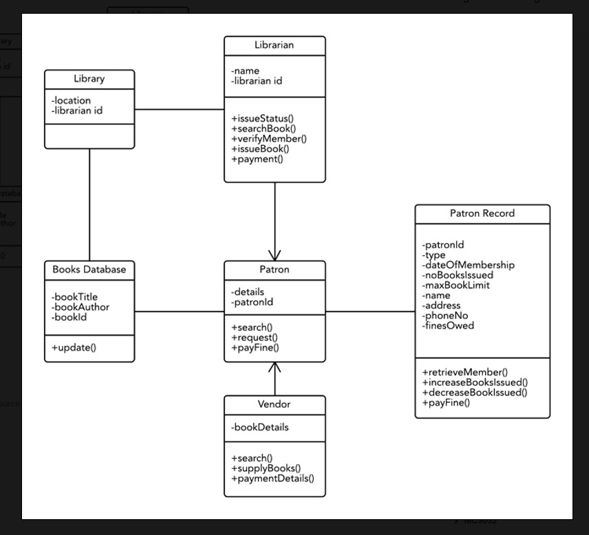

# Library Management System
This is a little program i have written in python to show relationships in a library management  system 

## Screenshots

## Objectives
- Have the main Library class 
- Have a child class called Librarian whos' parent class is the library class
- have a child class called Books_database 
- Have a Patron parent class
- Have a child class called Patron_record
- Have a Vendor class

## Goals 
- Using the above structure someone can interact with the library system on specific areas.

## To-do
- Error handling 
- Save data to text files
- Save data to database
  

**Email** 
<mwikyakimolo@gmail.com>
